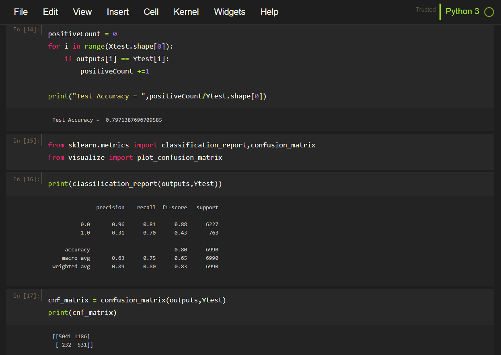
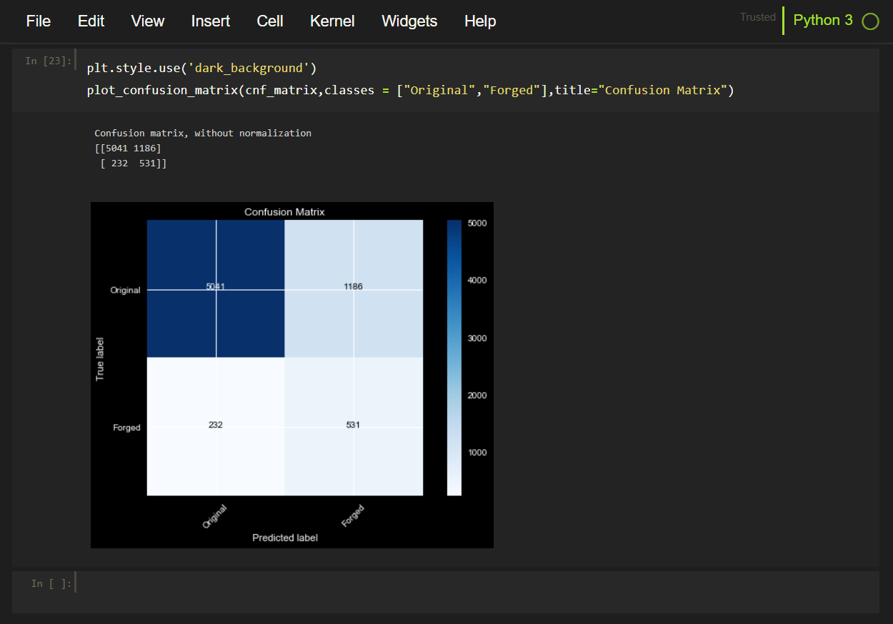
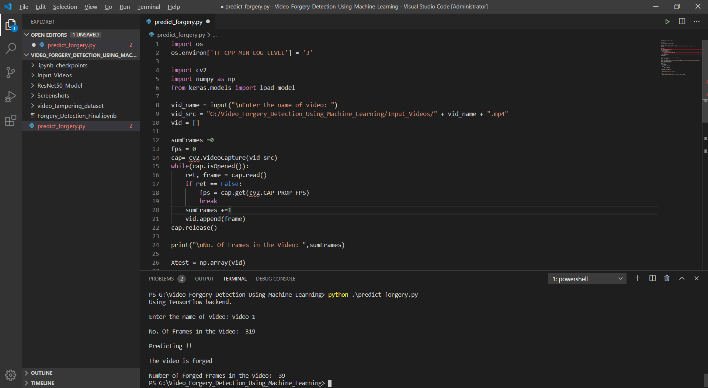

# Video Forgery Detection Model Using Machine Learning

This model predicts copy-move forgeries in the videos.

The model is trained on the REWIND: Video: Copy-move forgeries dataset

## About The Dataset

This dataset is composed by 20 video sequences: 10 original and 10 forged ones. Each sequence has a resolution of 320x240 pixels, and a frame-rate of 30 fps. Original sequences have been recorded using low-end devices, thus they have all been compressed at the origin (using either MJPEG or H264 codecs). Forged sequences have been saved as uncompressed file (RV24, 24 bit RGB). In order to uniform all the sequences to the same standard, they have all been converted to uncompressed YUV (4:2:0) files. Notice that some of the original sequences come from the Surrey University Library for Forensic Analysis (SULFA) database.
Each forged sequence is supplied with an additional MAT file, which contains the differences of the Y, U, and V components for each frame of the original and the forged sequence. This serves as the ground truth.

Download Link:
https://sites.google.com/site/rewindpolimi/downloads/datasets/video-copy-move-forgeries-dataset

## About The Model

The model is based on the ResNet50 architecture provided by Keras.

The following steps were used to make the model predict the copy-move video forgeries:

### 1. Data Preprocessing

The videos and the groundtruth were converted into numpy data, Xtrain and Ytrain respectively.

### 2. Training the Model

Training Results:
Train accuracy : 79.20%, Train loss : 0.3563
Validation accuracy : 78.33%, Validation loss : 0.3552

### 3. Model Testing

The precision and recall values:

ROC Curve:

### Predictions

Now, the model is able to predict the copy-move video forgeries:

